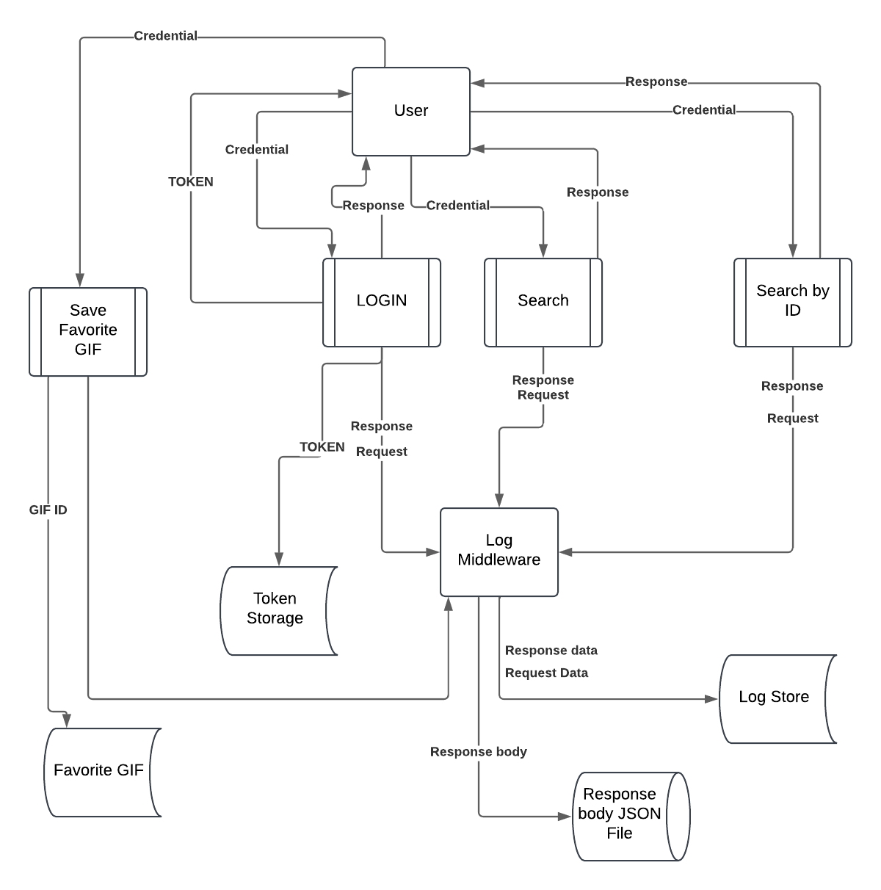
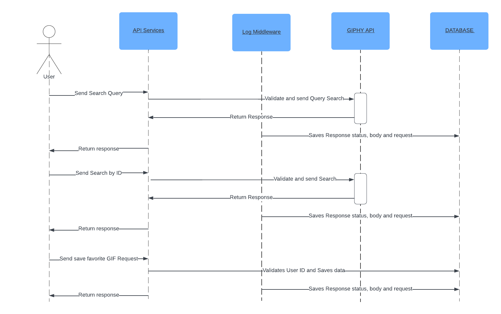
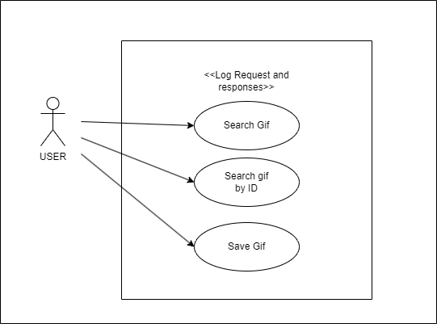

# Giphy Challenge

This is a technical test for PREX, use port 80 to access the API.
I decided to let the .env file in the repository to make it easier to run the project, but in a real scenario,
it should be in the .gitignore file. The KEY for the Giphy API is also in the .env file for the sake of simplicity in the test
but in a real scenario, it should be hidden too.

Also, there are several ways to save the json response for the Middleware case, but I decided to save each response in a 
json file and save the UUID in the DB.

When running the tests, the database is reset, so the data is not saved. Following the good
practices of testing, the data response is mocked.

## IMPORTANT
As step 5 says, the command "php artisan app:set-up" will run all the migrations, seeds and passport:install command, and just
in case generates a new key for the application.

There is a user for testing, but you can also create one with the fake user command or
the register endpoint.

```json
{
    "email": "testuser@example.com",
    "password": "password123"
}
```

## Installation

### STEP 1:
Clone the repository

### STEP 2:
run the following command to build and run the containers
```bash
docker-compose up -d
```

### STEP 3:
Run the following command to enter the container

```bash 
docker exec -it giphychallenge-php-1 /bin/zsh
```
### STEP 4:
run "composer install" (Inside the container)
or run
```bash
docker exec -it giphychallenge-php-1 composer install
```
(Outside the container)
### STEP 5:
run "php artisan app:set-up-command" to execute the migrations, seeds and everything needed to run the project
```bash
docker exec -it giphychallenge-php-1 php artisan app:set-up
```

## Commands

There are two commands available:
1. app:create-fake-user: Creates a user with the parameters email and password. If none is provided it will create a user with
   email => testuser@example.com and password => password123
2. app:set-up : Runs all migrations, seeds and passport:install command, and just in case generates a new key for the application

## Usage

1. When using Postman, Insomania or other use http://localhost:80

## Routes

### POST http://localhost/api/login
**Payload Schema:**

The endpoint expects the following JSON structure in the request payload:

```json
{
  "$schema": "http://json-schema.org/draft-07/schema#",
  "type": "object",
  "properties": {
    "email": {
      "type": "string",
      "format": "email",
      "description": "The user's email address."
    },
    "password": {
      "type": "string",
      "minLength": 6,
      "description": "The user's password."
    }
  },
  "required": ["email", "password"],
  "additionalProperties": false
}

```
--- 
### GET http://localhost/api/gifs/search
**Payload Schema:**

The endpoint expects the following JSON structure in the request payload:

```json
{
  "$schema": "http://json-schema.org/draft-07/schema#",
  "type": "object",
  "properties": {
    "query": {
      "type": "string",
      "description": "The search query term for finding GIFs."
    },
    "limit": {
      "type": "integer",
      "minimum": 1,
      "description": "The number of GIFs to return."
    },
    "offset": {
      "type": "integer",
      "minimum": 0,
      "description": "The offset for pagination."
    }
  },
  "required": ["query"],
  "additionalProperties": false
}

```
**Example Response Success (200):**
```json
{
  "$schema": "http://json-schema.org/draft-07/schema#",
  "type": "object",
  "properties": {
    "data": {
      "type": "array",
      "items": {
        "type": "object",
        "properties": {
          "id": { "type": "string" },
          "title": { "type": "string" },
          "url": { "type": "string", "format": "uri" }
        },
        "required": ["id", "title", "url"]
      }
    },
    "pagination": {
      "type": "object",
      "properties": {
        "total_count": { "type": "integer" },
        "count": { "type": "integer" },
        "offset": { "type": "integer" }
      },
      "required": ["total_count", "count", "offset"]
    }
  },
  "required": ["data", "pagination"],
  "additionalProperties": false
}
```
**Example Response Error (422):**
When the request payload is invalid, the endpoint will return a 422 Unprocessable Entity response with the following JSON structure:
```json
{
  "$schema": "http://json-schema.org/draft-07/schema#",
  "type": "object",
  "properties": {
    "message": { "type": "string" },
    "errors": {
      "type": "object",
      "additionalProperties": {
        "type": "array",
        "items": { "type": "string" }
      }
    }
  },
  "required": ["message", "errors"],
  "additionalProperties": false
}
```
---

### GET http://localhost/api/gifs/_ID_
**Payload Schema:**

The endpoint expects the following JSON structure in the request payload:

```json
{
  "$schema": "http://json-schema.org/draft-07/schema#",
  "type": "object",
  "properties": {
    "id": {
      "type": "string",
      "description": "The ID of the GIF to retrieve."
    }
  },
  "required": ["id"],
  "additionalProperties": false
}
```
**Example Response Success (200):**
```json
{
  "$schema": "http://json-schema.org/draft-07/schema#",
  "type": "object",
  "properties": {
    "data": {
      "type": "object",
      "properties": {
        "id": { "type": "string" },
        "title": { "type": "string" },
        "url": { "type": "string", "format": "uri" }
      },
      "required": ["id", "title", "url"]
    }
  },
  "required": ["data"],
  "additionalProperties": false
}

```
**Example Response Error (404):**
When the GIF with the specified ID does not exist, the endpoint will return a 404 Not Found response with the following JSON structure:
```json
{
  "$schema": "http://json-schema.org/draft-07/schema#",
  "type": "object",
  "properties": {
    "error": { "type": "string" }
  },
  "required": ["error"],
  "additionalProperties": false
}
```
**Example Response Error (422):**
When the request payload is invalid, the endpoint will return a 422 Unprocessable Entity response with the following JSON structure:
```json
{
  "$schema": "http://json-schema.org/draft-07/schema#",
  "type": "object",
  "properties": {
    "message": { "type": "string" },
    "errors": {
      "type": "object",
      "additionalProperties": {
        "type": "array",
        "items": { "type": "string" }
      }
    }
  },
  "required": ["message", "errors"],
  "additionalProperties": false
}
```
---
### POST http://localhost/api/gifs/favorite
**Payload Schema:**

The endpoint expects the following JSON structure in the request payload:

```json
{
  "$schema": "http://json-schema.org/draft-07/schema#",
  "type": "object",
  "properties": {
    "gif_id": {
      "type": "string",
      "description": "The ID of the GIF being saved."
    },
    "alias": {
      "type": "string",
      "description": "A custom alias for the saved GIF."
    },
    "user_id": {
      "type": "integer",
      "description": "The ID of the user saving the GIF."
    }
  },
  "required": ["gif_id", "alias", "user_id"],
  "additionalProperties": false
}

```

**Example Response Success (201):**
```json
{
  "$schema": "http://json-schema.org/draft-07/schema#",
  "type": "object",
  "properties": {
    "message": { "type": "string" }
  },
  "required": ["message"],
  "additionalProperties": false
}
```

**Example Response Error (404)**
This is when the user or the gif does not exist
```json
{
  "$schema": "http://json-schema.org/draft-07/schema#",
  "type": "object",
  "properties": {
    "error": { "type": "string" }
  },
  "required": ["error"],
  "additionalProperties": false
}
```

**Example Response Error (422):**
When the request payload is invalid, the endpoint will return a 422 Unprocessable Entity response with the following JSON structure:
```json
{
  "$schema": "http://json-schema.org/draft-07/schema#",
  "type": "object",
  "properties": {
    "message": { "type": "string" },
    "errors": {
      "type": "object",
      "additionalProperties": {
        "type": "array",
        "items": { "type": "string" }
      }
    }
  },
  "required": ["message", "errors"],
  "additionalProperties": false
}
```
--- 
# Diagrams

## Dataflow Diagram


## Security Diagram


## Use Case Diagram

